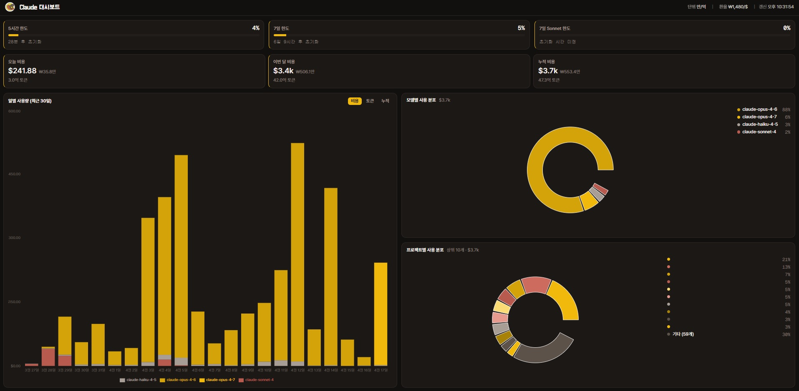

<div align="center">

# Claude Dashboard

**Claude Code 사용량 시각화 대시보드**

`~/.claude/projects/` 아래 JSONL 파일을 직접 파싱하여 대시보드 형태로 제공합니다..

[](https://nextjs.org)
[](https://www.typescriptlang.org)
[](https://tailwindcss.com)

</div>

---

## 스크린샷



---

## 실행

### Docker (권장)

```bash
# 빌드 + 실행
docker compose up -d --build

# 이후 재실행
docker compose up -d
```
`http://localhost:3777` 에서 확인. `docker-compose.yaml`에서 `~/.claude`를 read-only로 마운트하며, `restart: always`로 WSL 재시작 시 자동으로 올라옵니다.

### 로컬 개발

```bash
pnpm install
pnpm dev
# → http://localhost:3000
```

데이터 경로 변경 시:

```bash
CLAUDE_PATH=/path/to/.claude pnpm dev
```

---

## 동작 참고

화면에 안 드러나는 동작들:

- **사용 한도 위젯**은 Anthropic OAuth API에서 가져온 실측 값입니다 `~/.claude/.credentials.json`에 OAuth 토큰을 이용해 가져오며, 해당 토큰이 없으면 안내 메시지가 표시됩니다.
- 사용 한도 카드는 ~50% 기본색, ≥50% 보조색, ≥80% 경고색으로 바뀝니다. 한도 데이터가 없는 윈도우는 자동으로 숨겨집니다.
- **프로젝트별 분포**는 비용 기준 상위 10개만 표시하고, 11번째부터는 "기타 (N개)"로 묶입니다.
- 프로젝트명에서 홈 디렉터리 prefix와 `CLAUDE_REPO_PREFIX`(기본 `repo-`)가 자동 제거됩니다.
- **누적 차트**는 기울기가 가장 가파른 지점(최고 지출일)에 기준선이 표시됩니다.
- 환율은 헤더에서 클릭 후 직접 입력(Enter 확정), 토큰 단위는 만/억 ↔ K/M 토글입니다.

---

## 계산식

### 비용

```
비용 = (inputTokens × input단가
      + outputTokens × output단가
      + cacheCreationTokens × cacheWrite단가
      + cacheReadTokens × cacheRead단가) ÷ 1,000,000
```

### 요금표 (USD / 백만 토큰)

| 모델 | Input | Output | Cache Write | Cache Read |
|------|------:|-------:|------------:|-----------:|
| Claude Opus 4.7 / 4.6 / 4.5 | $5 | $25 | $6.25 | $0.50 |
| Claude Opus 4.1 / 4 | $15 | $75 | $18.75 | $1.50 |
| Claude Sonnet 4.x / 3.7 / 3.5 | $3 | $15 | $3.75 | $0.30 |
| Claude Haiku 4.5 | $1 | $5 | $1.25 | $0.10 |
| Claude Haiku 3.5 | $0.80 | $4 | $1.00 | $0.08 |
| Claude Haiku 3 | $0.25 | $1.25 | $0.3125 | $0.03 |
| Claude Opus 3 | $15 | $75 | $18.75 | $1.50 |

---

## 설정

### 환경변수

| 변수 | 기본값 | 설명 |
|------|--------|------|
| `CLAUDE_PATH` | `~/.claude` | Claude 데이터 루트 경로 |
| `CLAUDE_REPO_PREFIX` | `repo-` | 프로젝트명에서 제거할 추가 prefix |
| `TZ` | (호스트) | Docker 컨테이너 타임존 (기본 `Asia/Seoul`) |

### localStorage

| 키 | 기본값 | 설명 |
|----|--------|------|
| `claude-dashboard-exchange-rate` | `1480` | USD→KRW 환율 |
| `claude-dashboard-unit-mode` | `kr` | 토큰 단위 (`kr`: 만/억, `en`: K/M) |
