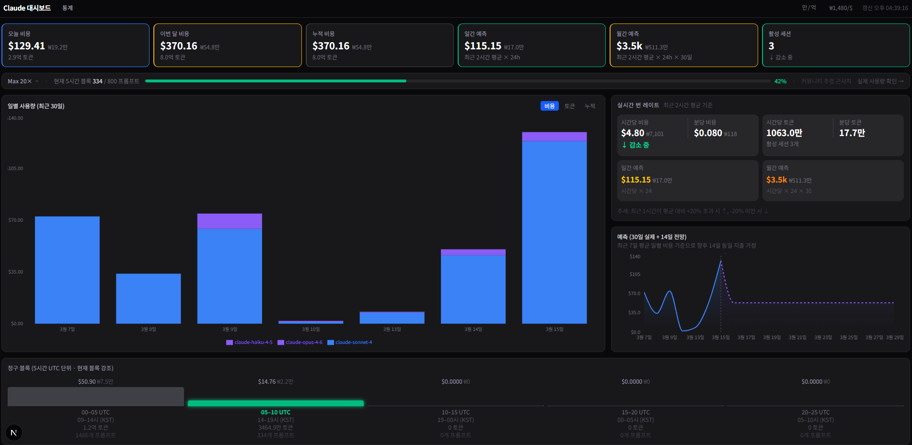
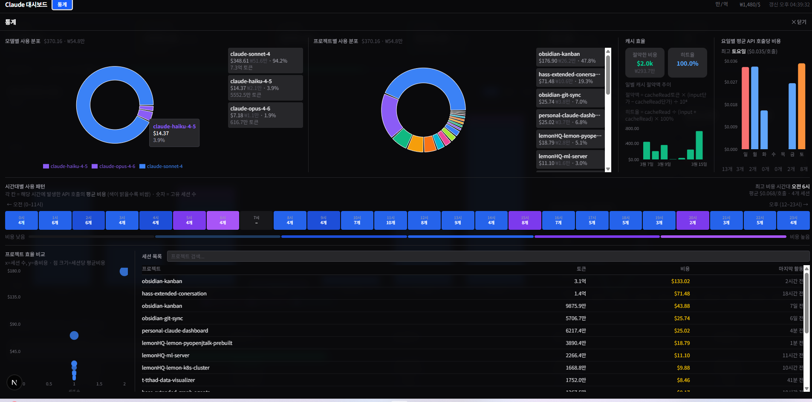

<div align="center">

# Claude Dashboard

**Claude Code 사용량 시각화 대시보드**

`~/.claude/projects/` 아래 JSONL 파일을 직접 파싱해 비용·토큰·세션·패턴을 실시간으로 분석한다.

[](https://nextjs.org)
[](https://www.typescriptlang.org)
[](https://tailwindcss.com)

</div>

---

## 스크린샷

### 메인 대시보드



### 통계 탭



---

## 실행

```bash
pnpm install
pnpm dev
# → http://localhost:3000
```

데이터 경로 변경 시:

```bash
CLAUDE_PATH=/path/to/.claude pnpm dev
```

---

## 화면 구성

### 메인 대시보드

#### KPI 카드 (상단 6개)

| 카드 | 설명 |
|------|------|
| 오늘 비용 | 오늘 발생한 총 API 비용 |
| 이번 달 비용 | 이번 달 누적 비용 |
| 누적 비용 | 전체 기간 합계 |
| 일간 예측 | 최근 2시간 평균 × 24h |
| 월간 예측 | 최근 2시간 평균 × 24h × 30일 |
| 활성 세션 | 최근 1시간 내 응답이 있는 세션 수 |

모든 비용 카드에 USD + KRW 동시 표시 (환율 클릭으로 직접 수정 가능).

#### 플랜 한도 바

현재 5시간 블록 내 프롬프트 수를 플랜 추정 한도와 비교.
80% 이상 → 노란색, 100% 초과 → 빨간색으로 경고.

#### 일별 사용량 차트 (최근 30일)

세 가지 모드 전환 가능:

- **비용** — 모델별 색상으로 구분된 스택 바 차트
- **토큰** — 동일 구조, 단위만 토큰
- **누적** — 30일 누적 합산 영역 차트
  - **일별 / 시간별** 서브 토글
  - 기울기가 가장 가파른 지점(지출 최고일·최고시간)에 노란 기준선 표시

#### 실시간 번 레이트 패널

| 항목 | 계산 |
|------|------|
| 시간당 비용 | 최근 2시간 총비용 ÷ 2 |
| 분당 비용 | 시간당 비용 ÷ 60 |
| 시간당 토큰 | 최근 2시간 토큰 ÷ 2 |
| 분당 토큰 | 시간당 토큰 ÷ 60 |
| 일간 예측 | 시간당 비용 × 24 |
| 월간 예측 | 시간당 비용 × 24 × 30 |

추세(↑ / → / ↓): 최근 1시간이 2시간 평균 대비 +20% 초과 시 증가, −20% 미만 시 감소.

#### 예측 차트 (30일 실적 + 14일 전망)

- 실선(파랑): 최근 30일 실제 일별 비용
- 점선(보라): 최근 7일 평균 일별 비용을 이후 14일에 동일 적용
- 실적↔전망 경계에서 두 선이 연결되어 갭 없이 표시

#### 청구 블록

Claude 사용량 제한은 UTC 기준 5시간 윈도우 단위로 적용됨.
각 블록에 UTC 시간, KST 변환, 토큰, 프롬프트 수, 비용(USD + KRW) 표시.

| 블록 | UTC | KST |
|------|-----|-----|
| 0 | 00–05 | 09–14시 |
| 1 | 05–10 | 14–19시 |
| 2 | 10–15 | 19–00시 |
| 3 | 15–20 | 00–05시 |
| 4 | 20–25 | 05–10시 |

현재 활성 블록은 초록색으로 강조.

---

### 통계 탭

헤더의 **통계** 버튼으로 전체 화면 오버레이 진입.

#### 상단 — 분포 & 패턴

**모델별 사용 분포**
도넛 파이차트 + 모델별 카드 (비용, KRW, 비율, 토큰).

**프로젝트별 사용 분포**
동일 구조. 세션 데이터를 프로젝트명으로 집계.
프로젝트명은 홈 디렉터리 경로 prefix 자동 제거.

**캐시 효율**
- 절약한 비용 (총액) + 히트율 수치 카드
- 일별 캐시 절약액 바 차트
- 계산식:
  ```
  절약액 = cacheRead토큰 × (input단가 − cacheRead단가) ÷ 1,000,000
  히트율 = cacheRead ÷ (input + cacheRead) × 100%
  ```

**요일별 평균 API 호출당 비용**
일~토 바 차트. 주말(일·토)은 다른 색으로 구분. 가장 비싼 요일 하이라이트.

#### 중단 — 시간대 히트맵

24시간 × 요일(전체 기간) 히트맵.
각 셀 = 해당 시간대 평균 비용, 숫자 = 고유 세션 수.
색상: 낮음(어두운 회색) → 높음(보라).

#### 하단 — 프로젝트 분석 & 세션 목록

**프로젝트 효율 비교 (산점도)**
- x축: 세션 수 / y축: 총비용 / 점 크기: 세션당 평균 비용
- 호버 시 프로젝트명·총비용·세션 수·세션당 비용 툴팁

**세션 목록**
비용 내림차순 정렬. 프로젝트명 검색 가능.
컬럼: 프로젝트 / 토큰 / 비용 / 마지막 활동 (상대 시간).

---

## 계산식 상세

### 비용 계산

```
비용 = (inputTokens × input단가
      + outputTokens × output단가
      + cacheCreationTokens × cacheWrite단가
      + cacheReadTokens × cacheRead단가) ÷ 1,000,000
```

#### 요금표 (USD / 백만 토큰)

| 모델 | Input | Output | Cache Write | Cache Read |
|------|------:|-------:|------------:|-----------:|
| Claude Opus 4.6 / 4.5 | $5 | $25 | $6.25 | $0.50 |
| Claude Opus 4.1 / 4 | $15 | $75 | $18.75 | $1.50 |
| Claude Sonnet 4.x / 3.7 / 3.5 | $3 | $15 | $3.75 | $0.30 |
| Claude Haiku 4.5 | $1 | $5 | $1.25 | $0.10 |
| Claude Haiku 3.5 | $0.80 | $4 | $1.00 | $0.08 |
| Claude Haiku 3 | $0.25 | $1.25 | $0.3125 | $0.03 |
| Claude Opus 3 | $15 | $75 | $18.75 | $1.50 |

### 플랜 한도

Anthropic 공식 API 없음. 커뮤니티 역산 추정값 사용.
실제 한도 확인: [claude.ai/settings/usage](https://claude.ai/settings/usage)

| 플랜 | 월 요금 | 추정 한도 (5시간 블록당) |
|------|--------:|------------------------:|
| Pro | $20 | ~40 프롬프트 |
| Max 5× | $100 | ~200 프롬프트 |
| Max 20× | $200 | ~800 프롬프트 |
| 직접 입력 | — | 사용자 지정 |

---

## 설정

### 헤더 컨트롤

| 컨트롤 | 설명 |
|--------|------|
| 만/억 ↔ K/M | 토큰 단위 전환 (클릭) |
| ₩1,480/$ | 환율 설정 (클릭 후 직접 입력, Enter 확정) |
| 플랜 선택 | 플랜 한도 바 기준값 설정 |

### 환경변수

| 변수 | 기본값 | 설명 |
|------|--------|------|
| `CLAUDE_PATH` | `~/.claude` | Claude 데이터 루트 경로 |
| `CLAUDE_REPO_PREFIX` | `repo-` | 프로젝트명에서 제거할 추가 prefix |

### localStorage

| 키 | 기본값 | 설명 |
|----|--------|------|
| `claude-dashboard-exchange-rate` | `1480` | USD→KRW 환율 |
| `claude-dashboard-unit-mode` | `kr` | 토큰 단위 (`kr`: 만/억, `en`: K/M) |
| `claude-dashboard-plan-id` | `none` | 선택한 플랜 ID |
| `claude-dashboard-plan-custom-prompts` | `100` | 직접 입력 플랜 한도 |

---

## 기술 스택

| 영역 | 라이브러리 |
|------|-----------|
| 프레임워크 | Next.js 16 (App Router) |
| 언어 | TypeScript 5 |
| 스타일 | Tailwind CSS 4 |
| 차트 | Recharts |
| 데이터 페칭 | SWR (30초 폴링) |
| 파싱 | Node.js fs + readline (서버사이드) |

### 데이터 흐름

```
~/.claude/projects/**/*.jsonl
        ↓ (서버사이드, Node.js)
   src/lib/parser.ts
        ↓
   API Routes (30초 인메모리 캐시)
        ↓ (SWR, 30초 폴링)
   React 컴포넌트
```

### API 엔드포인트

| 엔드포인트 | 반환 데이터 |
|-----------|------------|
| `GET /api/usage` | 오늘/이번달/전체 집계, 일별, 청구블록, 번 레이트, 예측 |
| `GET /api/models` | 모델별 사용량·비율 |
| `GET /api/cache` | 캐시 절약액·히트율·일별 추이 |
| `GET /api/patterns` | 시간대별·요일별 평균 패턴 |
| `GET /api/sessions` | 세션별 집계 (프로젝트·토큰·비용·마지막 활동) |
| `GET /api/hourly-costs` | 시간 단위 실제 비용 (누적 차트용) |
